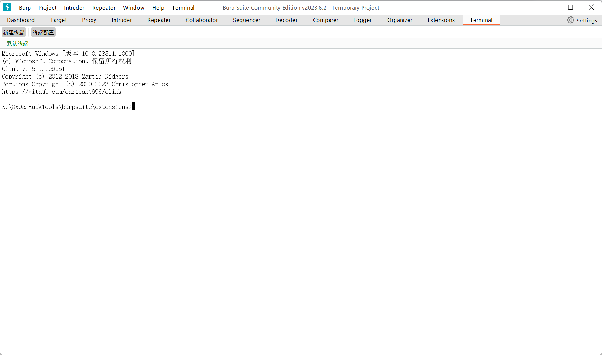

# burp-terminal

Burpsuite插件，给 Burpsuite 增加一个命令行终端功能。

### 安装依赖

```bash
mvn install:install-file -Dfile=libs/jediterm-core-3.20-SNAPSHOT.jar -DgroupId=com.jediterm  -DartifactId=jediterm-core -Dversion=3.20-SNAPSHOT -Dpackaging=jar
mvn install:install-file -Dfile=libs/jediterm-ui-3.20-SNAPSHOT.jar -DgroupId=com.jediterm  -DartifactId=jediterm-ui -Dversion=3.20-SNAPSHOT -Dpackaging=jar

```
### TODO
- [ ] 加载启动脚本（init.bat, init.sh）

### 截图
